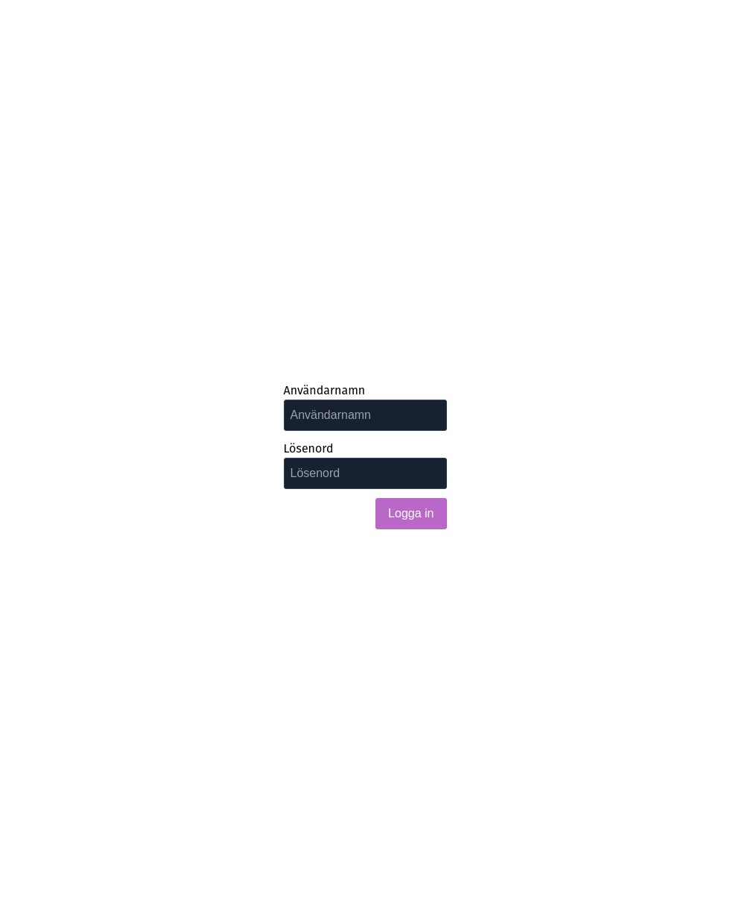
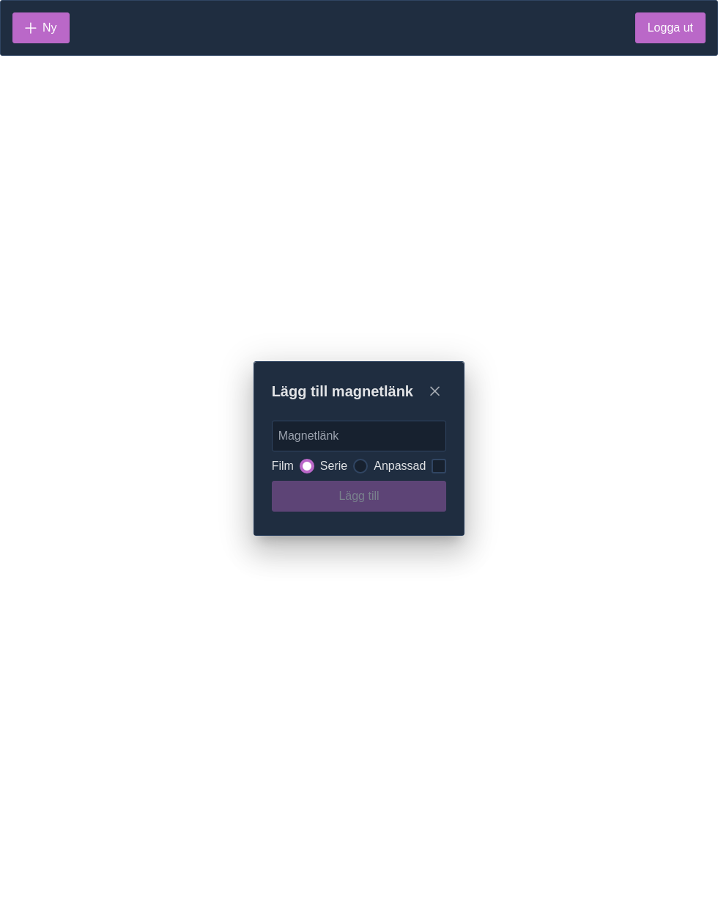
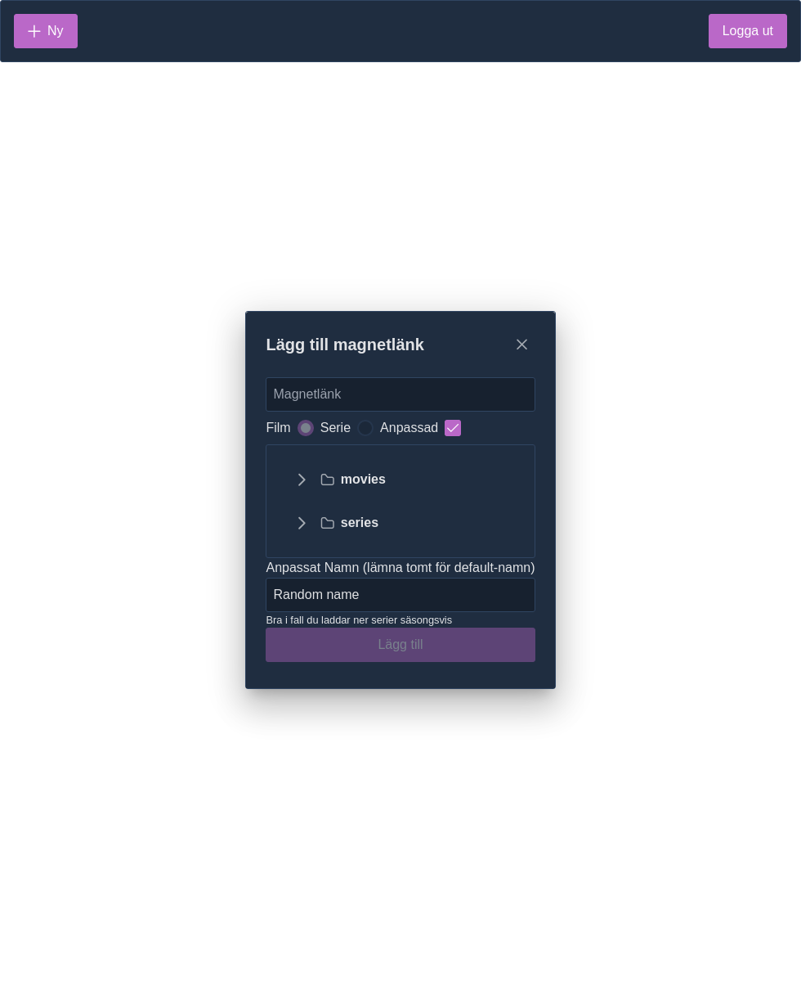
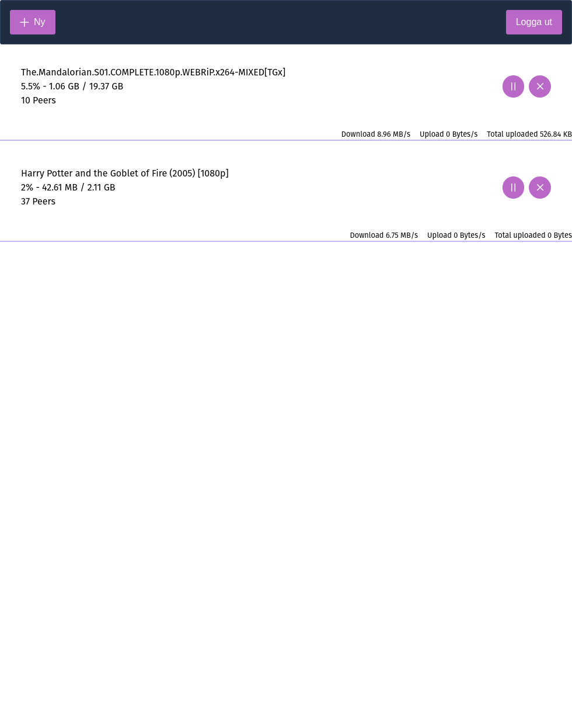

# NodeTorrent

## Project setup

```
npm install
```

### Compiles and hot-reloads for development

```
npm run start:dev
```

This starts the vue-cli build command with the watch flag as well as the express server that serves all the files.

## Description

This project is ment to run alongside plex in a docker container. Preferrably using docker compose. In the root of this project there is an example [docker compose](docker-compose.yml) that features an example setup with plex and NodeTorrent.

The docker image is available on dockerhub as maxrsb/node-torrent. Link to dockerhub is [here](https://hub.docker.com/repository/docker/maxrsb/node-torrent).

## Screenshots

<p align="center">
  
  
  
  
  
</p>
